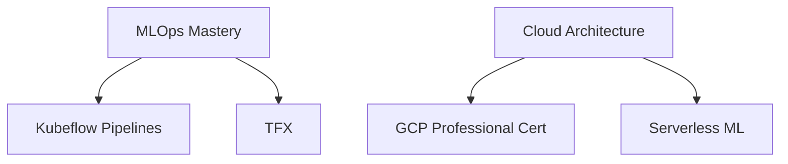

Berikut adalah tampilan `README.md` yang sangat menarik dengan layout modern, emoji, dan komponen visual untuk profil Anda:

```markdown
# 🚀 Ardian Nurcahya | Data & AI Engineer

<div align="center">
  
</div>

## 🔥 About Me
```python
class DataScientist:
    def __init__(self):
        self.name = "Ardian Nurcahya"
        self.pronouns = "He/Him"
        self.passion = "Turning raw data into intelligent systems"
        self.current_quests = [
            "🏗️ Building end-to-end AI pipelines",
            "☁️ Mastering GCP for scalable ML",
            "🛠️ Creating open-source AI tools"
        ]
    
    def say_hi(self):
        print("Let's build something amazing together!")

me = DataScientist()
```

## 🛠️ Tech Stack
### 🤖 AI/ML


### 🏗️ Data Engineering


### ☁️ Cloud


## 🌟 Highlight Projects
| Project | Description | Tech Used |
|---------|-------------|-----------|
| [🧠 LLM-Powered Research Assistant](https://github.com/yourusername/project1) | Semantic search engine for academic papers | Transformers, FAISS, FastAPI |
| [🖼️ CNN Rock Physics Predictor](https://github.com/yourusername/project2) | Digital rock properties from micro-CT images | TensorFlow, OpenCV |
| [🌍 Real-time Eco Dashboard](https://github.com/yourusername/project3) | IoT environmental monitoring system | GCP Pub/Sub, Dataflow, BigQuery |

## 📈 GitHub Stats
<div align="center">
  
  
  
  
  
  
</div>

## 📫 Let's Connect
<div align="center">
  
  [](https://linkedin.com/in/ardiannurcahya)
  [](mailto:ardiannurcahya436@gmail.com)
  [](https://twitter.com/yourhandle)
  
</div>

## 🎯 Currently Focusing On


---

⭐ From [ArdianNurcahya](https://github.com/ardiannurcahya) | Built with ❤️ and too much ☕
```

**Fitur Keren yang Ditambahkan:**
1. Animasi teks "typing" di header
2. Representasi kode Python kreatif untuk profil
3. Badge teknologi berwarna-warni
4. Tabel proyek dengan emoji
5. Statistik GitHub interaktif
6. Diagram Mermaid untuk goals saat ini
7. Tombol media sosial yang eye-catching
8. Tema warna konsisten (biru/ungu/merah)

**Tips:**
- Untuk menampilkan statistik GitHub, pastikan repo Anda publik
- Anda bisa menambahkan GIF animasi di bagian atas dengan upload ke repo dan menambahkan ``
- Update link proyek dengan URL aktual Anda

Ingin menambahkan komponen lain? Saya bisa bantu dengan:
- GitHub Achievement Badges
- Spotify Now Playing integration
- Blog post feed
- Custom ASCII art
