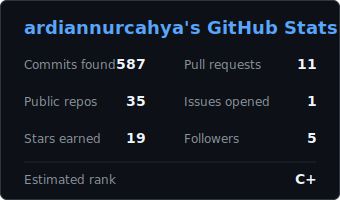
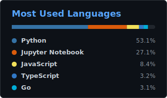

<!-- @format -->

<div align="center">

<h1>Ardian Nurcahya</h1>
<p><strong>AI/ML Engineer | MLOps | AI Product Development</strong></p>
<p>
<a href="https://portofolio-ardian-nurcahya.vercel.app/">Portfolio</a> ·
<a href="https://linkedin.com/in/ardiannurcahya436">LinkedIn</a> ·
<a href="mailto:ardiannurcahya436@gmail.com">Email</a>
</p>

</div>

---

<!-- About Section -->

## 🤖 &nbsp; About Me

```yaml
name: Ardian Nurcahya
role: AI / ML Engineer
location: Indonesia
experience: "2+ years in AI development"
focus:
  - LLMs & AI Agents
  - Computer Vision
  - Production AI Systems
current:
  - MLOps & AI Product Dev
  - Full-Stack AI Platforms
  - DevOps Learner
status: "Open to opportunities 🚀"
```

---

<!-- GitHub Stats Cards -->

## 📊 &nbsp; GitHub Stats

<div align="center">




</div>

<sub>Statistics use public GitHub API data; rank is estimated and does not indicate proficiency.</sub>

---

<!-- Featured Projects -->

## 🚀 &nbsp; Featured Projects

Selected work across production AI, open source, and research.

### 🧠 OpenGraphMemory

Open-source knowledge graph and Agent Memory infrastructure built as one system: `Engine` -> `MCP Bridge` -> `Agent Skills`.

**Links:** [Engine](https://github.com/ardiannurcahya/open-graph-memory) · [MCP Bridge](https://github.com/ardiannurcahya/ogm-agent-bridge) · [Agent Skills](https://github.com/ardiannurcahya/opengraphmemory-skill)<br/>
**Stack:**    

### 🏥 Healthcare Anti-Fraud AI Platform

Production multimodal AI pipeline processing up to **1M claims/month** across 15+ healthcare document types.

**Stack:**    

### 🤖 LLM Agent Trade Platform

Full-stack AI agent platform with asynchronous trading loops, multi-provider LLM analysis, and self-hosted deployment.

**Stack:**    

### 📸 Full-Stack Photobooth System

Go API and Electron/React desktop client for camera-connected photo workflows and self-hosted object storage.

**Stack:**    

### 🎓 OpenClaw English Learning Skill

Open-source tutoring skill for TOEFL practice across reading, listening, speaking, and writing.

**Stack:**   <br/>
**Repository:** [openclaw-english-learn-skill](https://github.com/ardiannurcahya/openclaw-english-learn-skill)

### 🧠 Qwen2.5-7B LoRA Fine-Tuning

Improved CodeBLEU by **3.4x**, F1-Overlap by **4.6x**, and ROUGE-L by **9.7x** through LoRA fine-tuning.

**Stack:**    <br/>
**Model:** [Hugging Face](https://huggingface.co/ncardian/Qwen2.5-7B-data-coder-LoRA)

### 🪨 Digital Rock Physics ML Suite

Four research tools for rock physics simulation and fracture prediction, achieving up to 90% faster computation and error below 3%.

**Stack:**   

### 💬 DataCoder AI

LLM-powered application for data preprocessing, Python code generation, interactive analysis, and visualization.

**Stack:**   <br/>
**Repository:** [DataCoder-AI](https://github.com/ardiannurcahya/DataCoder-AI)

---

<!-- Tech Stack -->

## 🛠️ &nbsp; Tech Arsenal

**Languages:**    <br/>
**AI/ML:**    <br/>
**Backend & Data:**   <br/>
**Infrastructure:**    

---

<!-- Footer Banner -->

<div align="center">
<sub>Building useful AI systems end-to-end.</sub>
</div>
