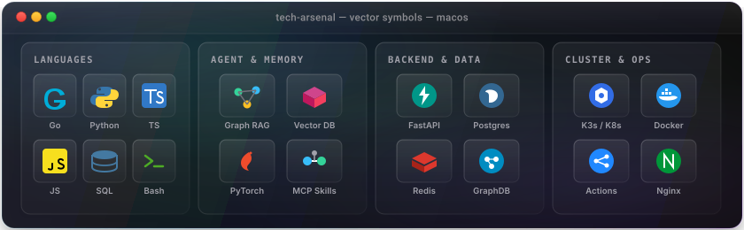

<!-- @format -->

<!-- Developer Profile Hero Banner -->

 

<!-- Action Triggers (Compact Flat-Square) -->

  
  &nbsp;
  
  &nbsp;
  

---

<!-- Pure Vector Tech Stack Matrix -->

  

 

<!-- Activity Metrics & Language Distribution -->

  
  

 

<!-- Custom Animated Contribution Activity Stream -->
<!--

  

-->
---

<!-- Footer -->

  <code>AUTONOMOUS PROTOCOLS • ARCHITECTED BY <a href="https://linkedin.com/in/ardiannurcahya436">ARDIAN NURCAHYA</a></code>

